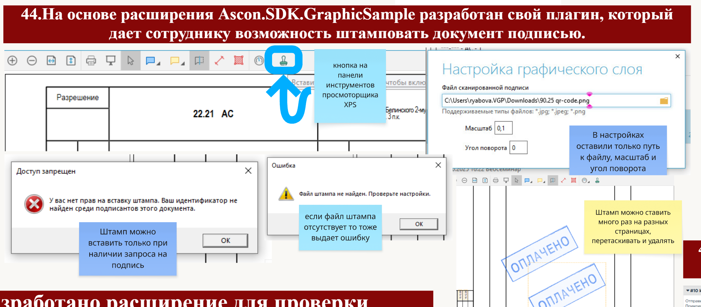

# Signature Stamping Plugin

## English

This plugin is based on the Ascon.Pilot.SDK.GraphicLayerSample extension and provides the ability to place signature stamps on XPS documents.

Users can place multiple stamps on different pages, move them, and remove them when necessary.

Stamp placement is only available when a signature request exists. If the configured stamp image file is missing, the plugin displays an error message and prevents stamp insertion.

The functionality is available through a toolbar button in the XPS document viewer.

The plugin settings have been simplified and include only:
- stamp image file path
- scale
- rotation angle

### Note

The plugin source code is provided separately from the original solution and does not include the *.sln file.

---

## Русский

Данный плагин разработан на основе расширения Ascon.Pilot.SDK.GraphicLayerSample и предоставляет возможность проставления штампов подписи на XPS-документах.

Пользователь может размещать неограниченное количество штампов на различных страницах документа, перемещать их и удалять при необходимости.

Установка штампа доступна только при наличии запроса на подпись. Если файл изображения штампа отсутствует, плагин выводит сообщение об ошибке и блокирует добавление штампа.

Функциональность доступна через кнопку на панели инструментов просмотрщика XPS-документов.

Настройки плагина были упрощены и содержат только:
- путь к файлу изображения штампа
- масштаб
- угол поворота

### Примечание

Исходный код плагина выгружен отдельно от основного решения и не содержит файл *.sln.

